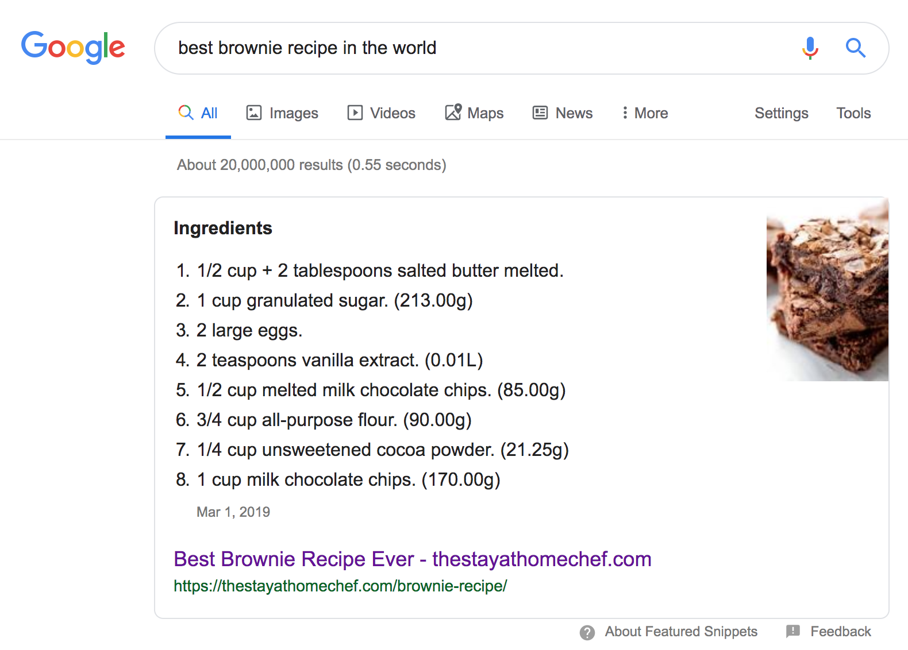
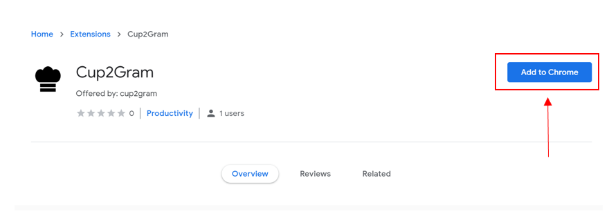
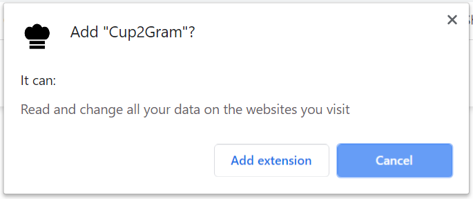
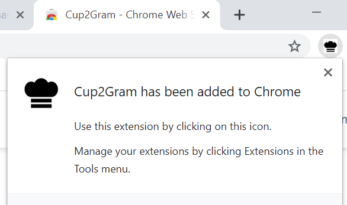

 
# Cup2Gram Chrome extension
## Issue Description
The user needed a solution for converting recipe ingredient quantities in the browser. When using American recipes, quantities listed in cups needed to be converted to metric equivalents. Existing tools required user input for each individual quantity, a tedious process that led to user frustration.
## Desired Functionality
The user wanted the ability to view a recipe in the browser with the ingredient quantities converted automatically.
## Solution Documentation
A Chrome extension (Cup2Gram) was developed to achieve the desired functionality. Available in the Chrome Web Store, the extension automatically converts ingredient amounts and units on the webpage, as shown below (Figure 1).

## Deployment Instructions
To use Cup2Gram, the user must follow these steps:
1. Open Chrome web browser and access the extension on the [Chrome Web Store](https://chrome.google.com/webstore/detail/cup2gram/obcfddpfmiopcafbphnomjepgopgigah).
2. Click "Add to Chrome".

3. The window shown below will appear, notifying the user of the extension's Site access capabilities. Click "Add extension".  

4. When the extension has been successfully added, the window below will appear, noting that the icon need only be clicked to be used.  

5. Visit a recipe webpage to see how Cup2Gram converts ingredient quantities and units.

## Testing
This extension was tested in Chrome, Version 78.0.3904.70 (Official Build) (64-bit).

## License
[MIT](https://github.com/tayharvey/cup2gram/blob/master/LICENSE.txt)
