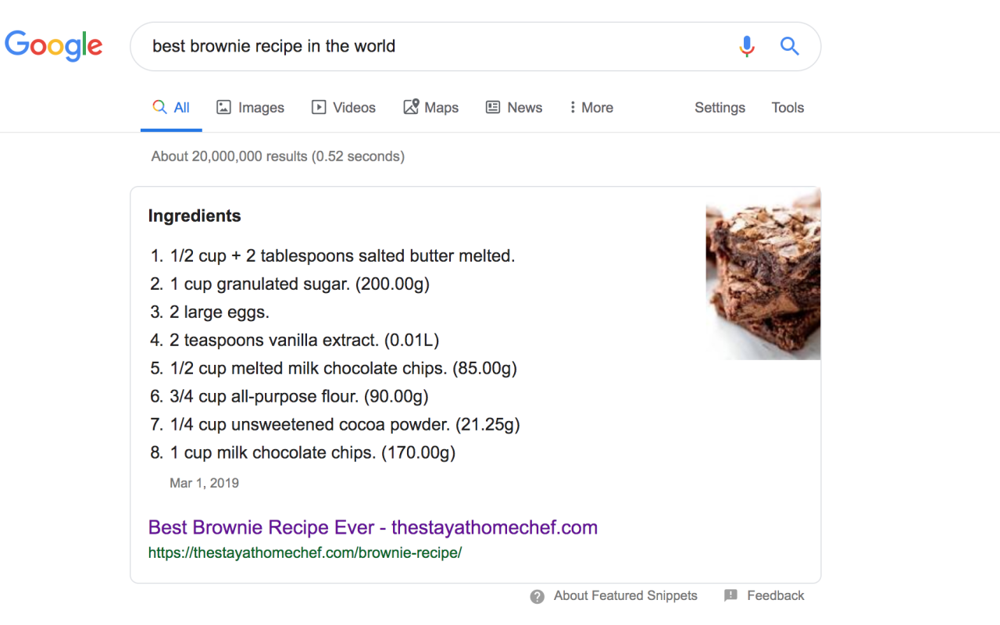
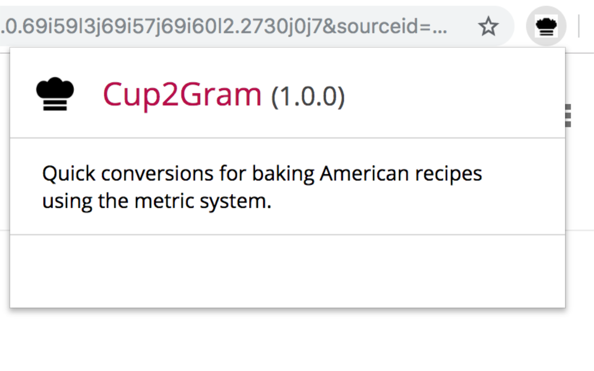

Do you often find yourself converting ingredients from American recipe sites to the metric system, manually entering quantities into online conversion tools?

The Cup2Gram Chrome extension allows you to view American recipes with ingredient quantities converted to the metric system.

## Usage
This [extension]() is available in the Chrome Web Store.

When added to Chrome, the extension will automatically convert ingredient amounts and units on the page.

## License
[MIT](https://github.com/tayharvey/cup2gram/LICENSE.txt)
